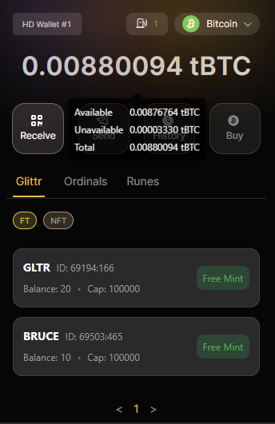
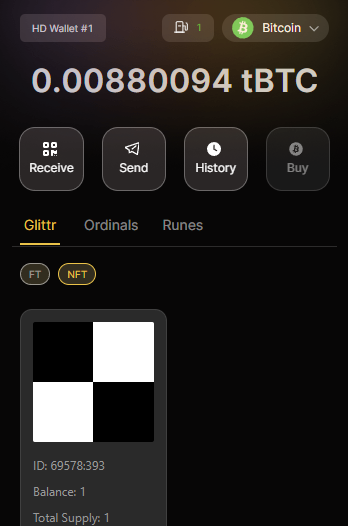

# Glittr Wallet
### Forked from [Unisat Wallet](https://github.com/unisat-wallet/extension)

Glittr Wallet - Your wallet to show Glittr native assets and do transactions!

- Website: https://glittr.fi

## Build

- Install [Node.js](https://nodejs.org) version 15
- Install [Yarn](https://yarnpkg.com/en/docs/install)
- Install dependencies: `yarn`
- Build the project to the `./dist/` folder with `yarn build:firefox` for Firefox
- Build the project to the `./dist/` folder with `yarn build:chrome` for Chrome
- Develop: `yarn build:chrome:dev`

## Run

- Go to `chrome://extensions/`
- Click "Load unpacked"
- Select the `./dist/<browser name from the build command>` folder

Supported Networks: Testnet, Devnet (regtest)
